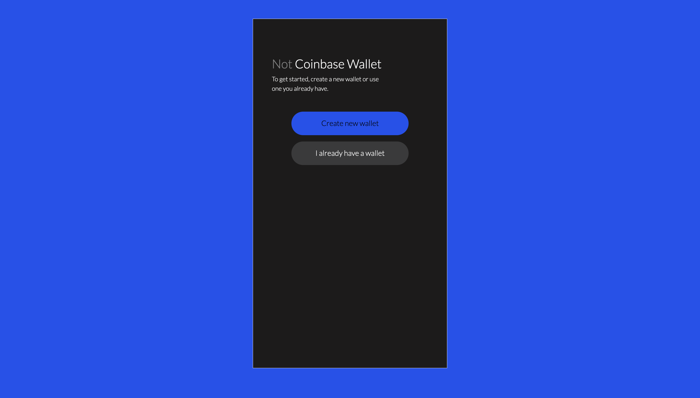
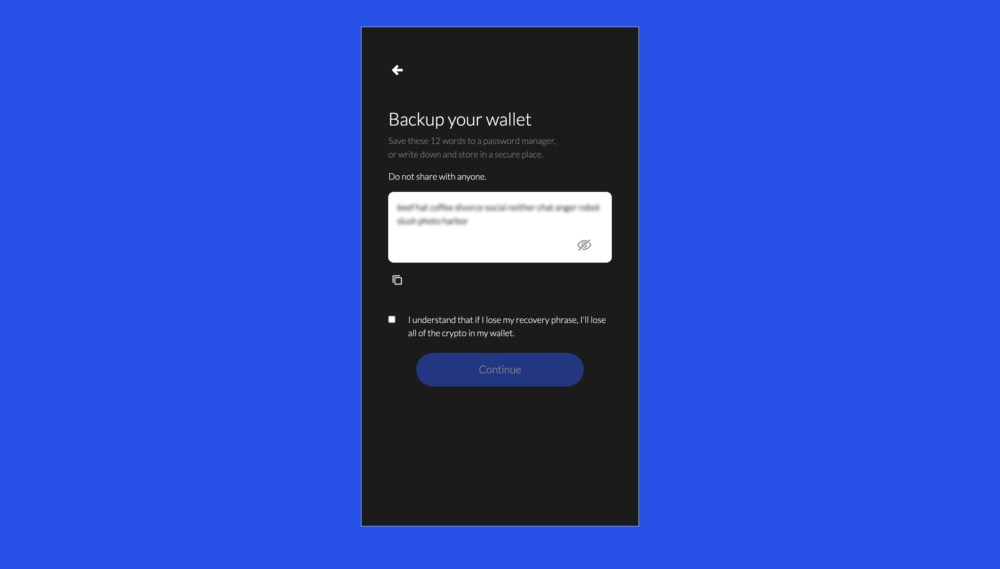
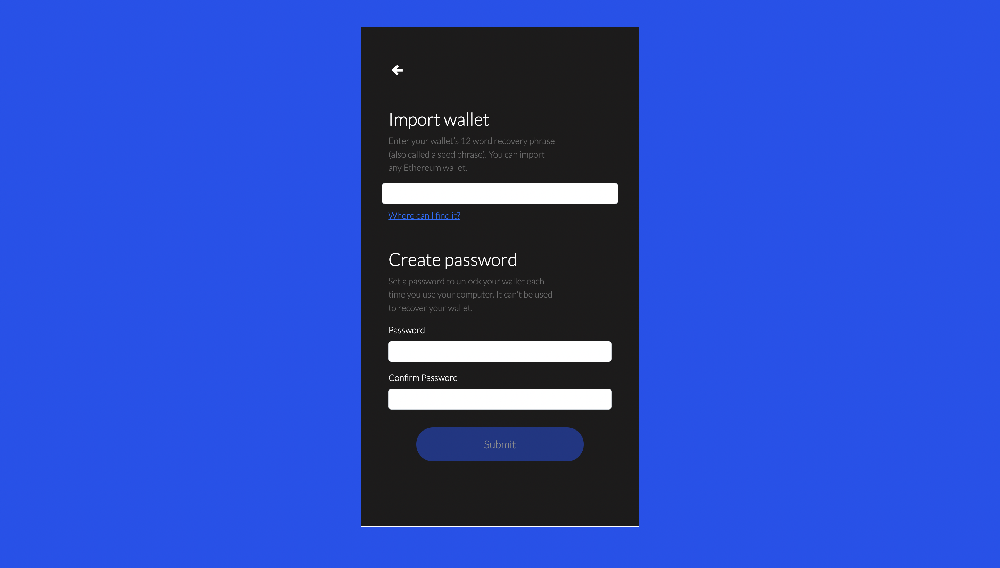
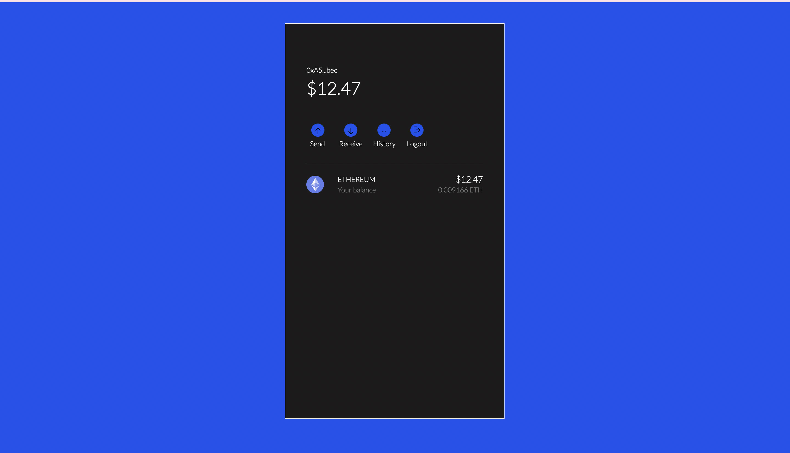
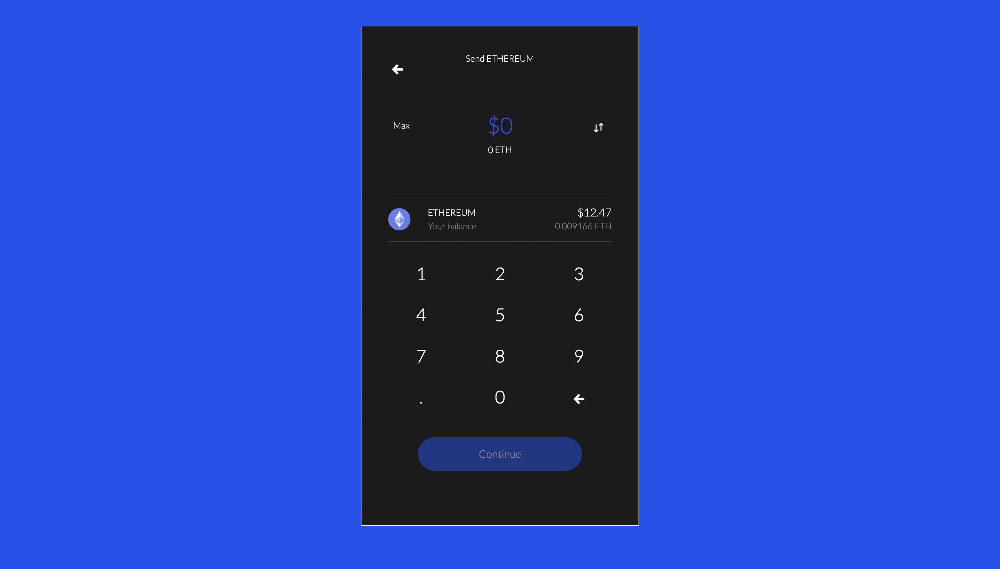
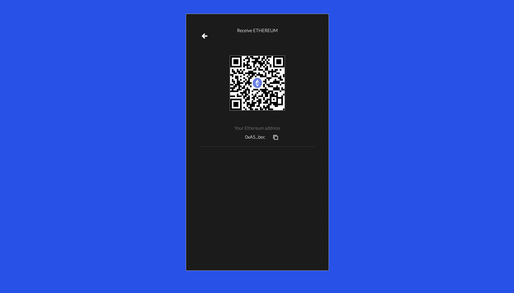
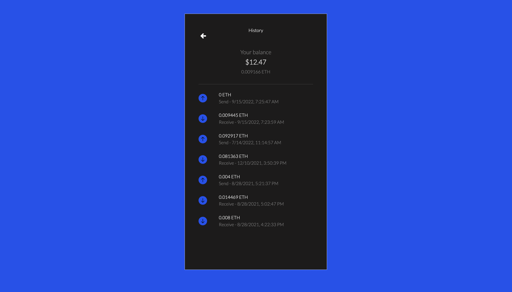
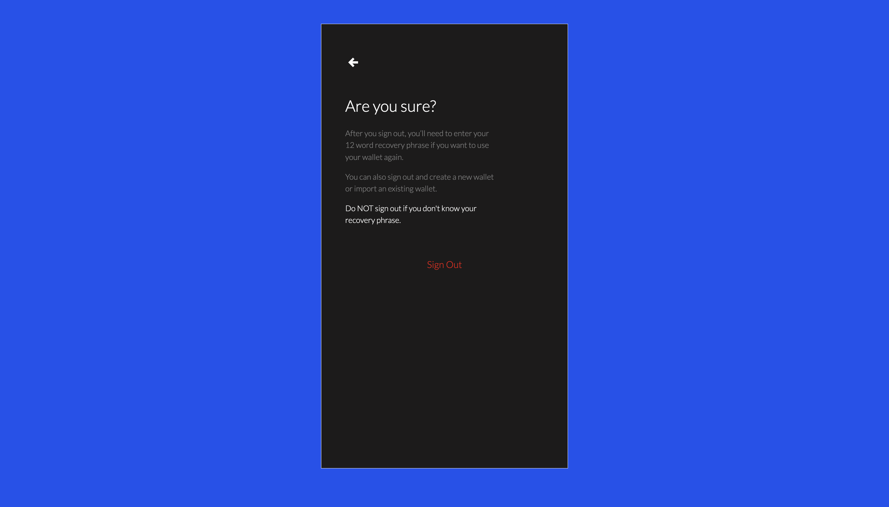

# Not Coinbase Wallet
Inspired by the design of Coinbase Wallet. This self-custody allows users to send, receive and view their cryptocurrency transaction history.

## Key Features
- QR Code generated for wallet for Receiving transactions
- List of transactions associated with address populated in History page
- Balance in Ethereum and value in USD posted in Home page
- Send page includes original numpad to allow for accurate inputs
- Max button on numpad allows users to easily set transaction amount
- Users can generate a new wallet address when signing up

## Screenshots of Each Page

### Landing Page

### New Wallet

### Existing Wallet

### Home

### Send

### Receive

### History

### Log Out
