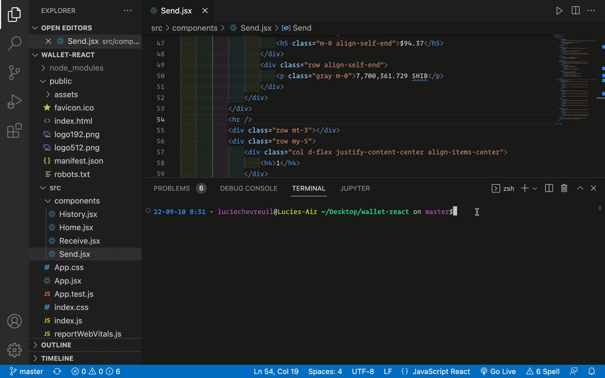
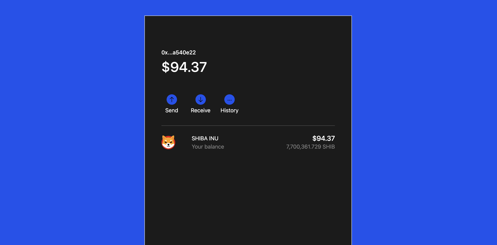
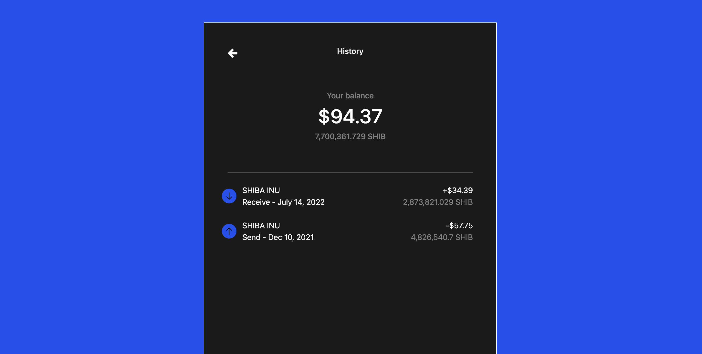
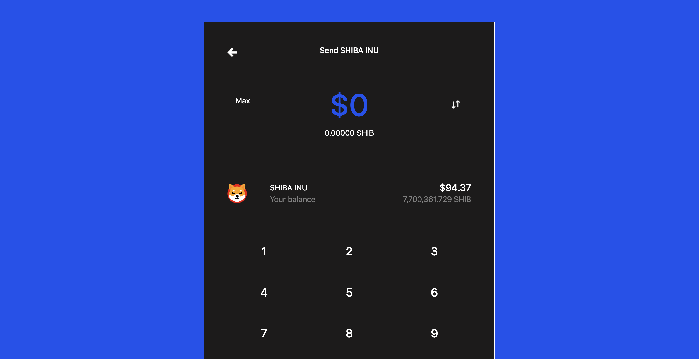

# Self Custody Wallet React App

Inspired by the design of Coinbase Wallet. This self-custody wallet will be connected to a Smart Contract for a single Ethereum token where users can send, receive and view their cryptocurrency transaction history.

## Roadmap

- [x] Design mock-up in Figma
  - Figma Clickable Prototype: https://tinyurl.com/mvknm8jb
  - Figma Document: https://tinyurl.com/3y32v9t4
- [x] Build HTML and CSS templates for each page
- [x] Convert to React app front-end
- [x] Build numpad functionality
  - See Numpad demo below with side-by-side of Coinbase Wallet
- [ ] Build out backend and database
- [ ] Connect to a Smart Contract
- [ ] Deployment

### React App Front-End Demo

### Numpad demo below with side-by-side of Coinbase Wallet

## Screenshots of Each Page

### Home page

### History page

### Send page

